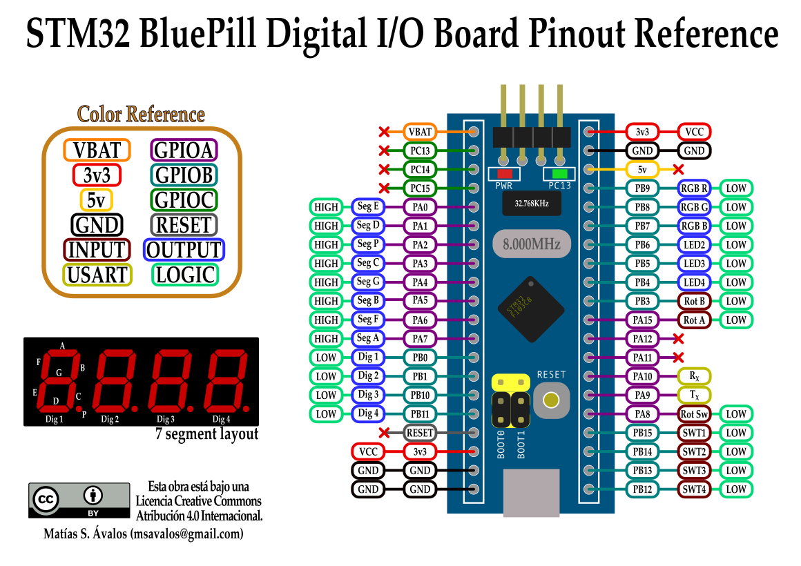
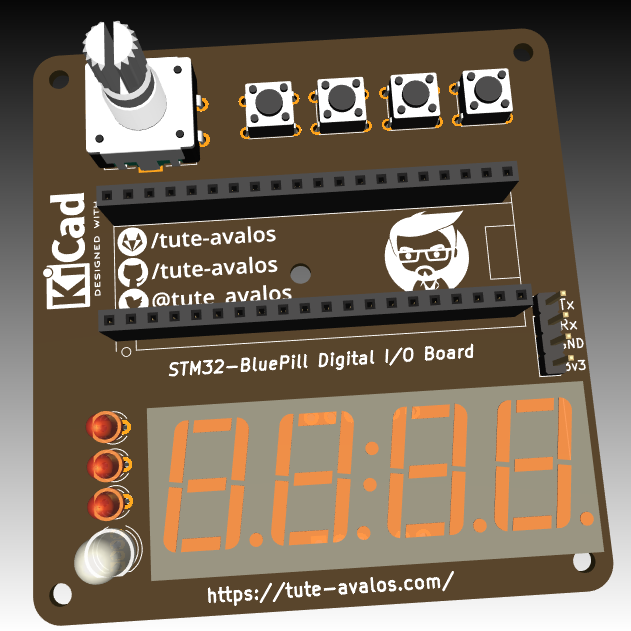
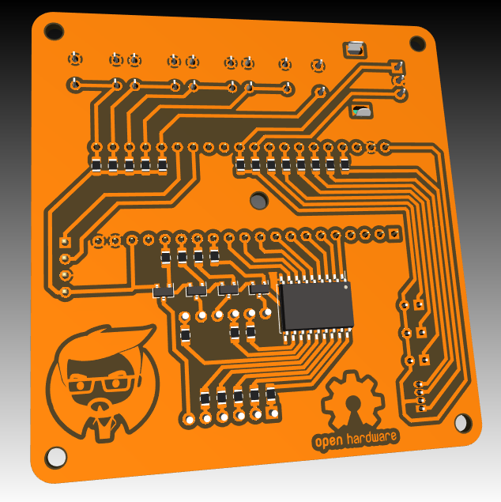

# STM32-BluePill Digital I/O Board

This Open Source Hardware PCB proyect is a tool for teach µController (microcontroller) programming. Feel free to use, modifie or improobe it in any way you want. The schematics and the layout was designed on [KiCad EDA Software](https://kicad-pcb.org/).

More information (Spanish only): [BluePill STM32 Digital I/O Board v3.0](https://blog.tute-avalos.com/2021/08/18/blue-pill-stm32-digital-i-o-board-v3-0/)

- - -

Este PCB es un poryecto de Hardware Libre y Abierto, pensado para enseñar programación de µControladores (microcontroladores). Sientase libre de usarlo, modificarlo y/o mejorarlo en cualquier sentido que desee. Los esquemáticos y el PCB fueron diseñados utilizando el software [KiCad EDA](https://kicad-pcb.org/).

- - -

# Pinout Configuration

## OUTPUTS

| PIN  | Conection     | Active | | PIN  | Conection     | Active |
|------|---------------|--------|-|------|---------------|--------|
| PB9  | LED1 - Red    | LOW    | | PA0  |  Seg E        |  HIGH  |
| PB8  | LED1 - Green  | LOW    | | PA1  |  Seg D        |  HIGH  |
| PB7  | LED1 - Blue   | LOW    | | PA2  |  Seg P        |  HIGH  | 
| PB6  | LED2          | LOW    | | PA3  |  Seg C        |  HIGH  |
| PB5  | LED3          | LOW    | | PA4  |  Seg G        |  HIGH  |
| PB4  | LED4          | LOW    | | PA5  |  Seg B        |  HIGH  |
| PC13 | Build-in LED  | LOW    | | PA6  |  Seg F        |  HIGH  |
|  -   |      -        |   -    | | PA7  |  Seg A        |  HIGH  |
|  -   |      -        |   -    | | PB0  |  Disp 1 (MSD) |  LOW   |
|  -   |      -        |   -    | | PB1  |  Disp 2       |  LOW   |
|  -   |      -        |   -    | | PB10 |  Disp 3       |  LOW   |
|  -   |      -        |   -    | | PB11 |  Disp 4 (LSD) |  LOW   |

## INPUTS

| PIN  | Conection     | Active |
|------|---------------|--------|
| PA15 | Rotary - A    | LOW    |
| PB3  | Rotary - B    | LOW    |
| PA8  | Rotary Switch | LOW    |
| PB15 | Button 1      | LOW    |
| PB14 | Button 2      | LOW    |
| PB13 | Button 3      | LOW    |
| PB12 | Button 4      | LOW    |

## Reference

## Images

|  | |
|-|-|
|
top layout
|
bottom layout
|
